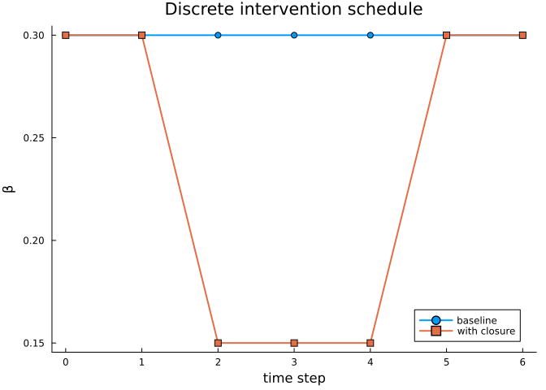

# Discrete schedules and categorical representations


This vignette shows how to apply interventions to discrete-time
schedules and how to export program structure to Catlab objects.

``` julia
using Catlab: nparts
using CategoricalInterventions
using Plots

default(; linewidth=2, markersize=4, grid=false)

beta = Target(
    :beta;
    kind=Parameter,
    value_type=Float64,
    algebra=MultiplicativeAlgebra(),
)

program = InterventionProgram(
    InterventionAtom(:closure, beta, Interval(2, 5), Scale(0.5)),
)

times = collect(0:6)
baseline = Dict(:beta => fill(0.30, length(times)))

output = apply_discrete(program, baseline, times)
collect(zip(times, baseline[:beta], output[:beta]))
```

    7-element Vector{Tuple{Int64, Float64, Float64}}:
     (0, 0.3, 0.3)
     (1, 0.3, 0.3)
     (2, 0.3, 0.15)
     (3, 0.3, 0.15)
     (4, 0.3, 0.15)
     (5, 0.3, 0.3)
     (6, 0.3, 0.3)

The intervention can be viewed as an edit to a time-indexed parameter
schedule.

``` julia
plot(
    times,
    baseline[:beta];
    label="baseline",
    marker=:circle,
    xlabel="time step",
    ylabel="β",
    title="Discrete intervention schedule",
)
plot!(times, output[:beta]; label="with closure", marker=:square)
```



The same interval structure can be normalized into epochs and
represented as a finite function from sampled times to epochs.

``` julia
epochs = epochize(program)
active_times = collect(2:4)
f = epoch_finfunction(active_times, epochs)

collect(f)
```

    3-element Vector{Int64}:
     1
     1
     1

`epoch_finfunction` expects times that lie inside active intervention
epochs. For times outside those epochs, keep the original schedule
values from `apply_discrete`.

The program can also be exported as an attributed C-set.

``` julia
acset = as_acset(program)

(
    atoms = nparts(acset, :Atom),
    targets = nparts(acset, :TargetObj),
)
```

    (atoms = 1, targets = 1)

The ACSet representation is useful when interventions should be treated
as data: for example, for comparing programs, checking structure, or
wiring interventions into larger categorical model-building workflows.
