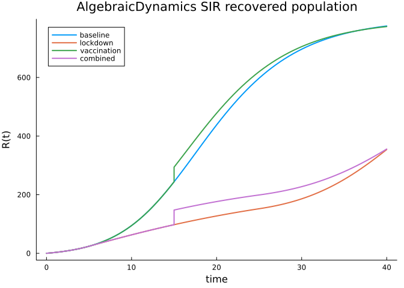
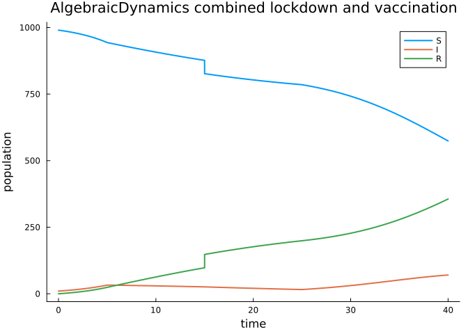

# AlgebraicDynamics SIR callbacks


This vignette represents the same SIR intervention problem with
`AlgebraicDynamics.jl`. The SIR model is composed from two continuous
resource sharers: infection couples the `S` and `I` resources, and
recovery couples the `I` and `R` resources.

The values match the `epirecipes/sir-julia` parameterization used in the
AlgebraicPetri and StockFlow vignettes: `S(0)=990`, `I(0)=10`, `R(0)=0`,
contact rate `c=10`, transmission probability `β=0.05`, and recovery
rate `γ=0.25`.

This vignette has its own local `Project.toml` because
`AlgebraicDynamics.jl` currently resolves against older `Catlab.jl` and
`DiffEqCallbacks.jl` versions than the main vignette environment.

``` julia
using AlgebraicDynamics
using Catlab.Programs
using Catlab.WiringDiagrams: oapply
using CategoricalInterventions
using ComponentArrays
using DiffEqCallbacks
using OrdinaryDiffEq
using Plots

default(; linewidth=2, grid=false)

function infection_dynamics(u, p, t)
    rate = p.inf * u[1] * u[2]
    return [-rate, rate]
end

function recovery_dynamics(u, p, t)
    rate = p.rec * u[1]
    return [-rate, rate]
end

infection = ContinuousResourceSharer{Float64}(2, infection_dynamics)
recovery = ContinuousResourceSharer{Float64}(2, recovery_dynamics)

sir_pattern = @relation (S, I, R) begin
    infection(S, I)
    recovery(I, R)
end

sir_system = oapply(sir_pattern, [infection, recovery])
```

`AlgebraicDynamics.jl` preserves the resource order from the relation as
a positional state vector. We therefore keep parameters labelled with
`ComponentArrays.jl`, but use explicit positional selectors for state
pulses.

``` julia
u0 = [990.0, 10.0, 0.0]
p0 = ComponentArray(inf=0.05 * 10.0 / sum(u0), rec=0.25)
tspan = (0.0, 40.0)
save_grid = 0.0:0.5:40.0

prob = ODEProblem(sir_system, u0, tspan, p0)
baseline = solve(prob, Tsit5(); saveat=save_grid)

baseline.retcode, baseline[3, end], sum(baseline.u[end])
```

    (SciMLBase.ReturnCode.Success, 775.6835918156384, 999.9999999999999)

## Interventions

The callback indexing uses symbolic selectors for the labelled parameter
vector and positional selectors for the state vector created by
`oapply`.

``` julia
indexing = PetriIndexing(
    Dict(:inf => :inf, :rec => :rec),
    Dict(:S => 1, :I => 2, :R => 3),
)

inf_rate = Target(
    :inf;
    kind=Parameter,
    value_type=Float64,
    algebra=MultiplicativeAlgebra(),
)

lockdown = InterventionProgram(
    InterventionAtom(:lockdown, inf_rate, Interval(5.0, 25.0), Scale(0.5)),
)

susceptible = Target(:S; kind=State, value_type=Float64, algebra=AdditiveAlgebra())
recovered = Target(:R; kind=State, value_type=Float64, algebra=AdditiveAlgebra())

vaccination = InterventionProgram(
    InterventionAtom(:vaccinate_from_s, susceptible, Interval(15.0, 16.0), Add(-50.0)),
    InterventionAtom(:vaccinate_to_r, recovered, Interval(15.0, 16.0), Add(50.0)),
)

combined = compose_interventions(lockdown, vaccination)
```

    InterventionProgram(3 atoms)

``` julia
lockdown_sol = solve(
    prob,
    Tsit5();
    callback=to_callback(lockdown, indexing; baseline_p=p0),
    saveat=save_grid,
)

vaccination_sol = solve(
    prob,
    Tsit5();
    callback=to_callback(vaccination, indexing),
    saveat=save_grid,
)

combined_sol = solve(
    prob,
    Tsit5();
    callback=to_callback(combined, indexing; baseline_p=p0),
    saveat=save_grid,
)

(
    baseline_R = baseline[3, end],
    lockdown_R = lockdown_sol[3, end],
    vaccination_R = vaccination_sol[3, end],
    combined_R = combined_sol[3, end],
    combined_total = sum(combined_sol.u[end]),
)
```

    (baseline_R = 775.6835918156384, lockdown_R = 354.0601010312817, vaccination_R = 773.7286478303149, combined_R = 355.8150819160382, combined_total = 1000.0)

## Cross-check against the same SIR equations

The direct SIR equations should match the composed
`AlgebraicDynamics.jl` resource-sharer model. This is the check that the
AlgebraicPetri, StockFlow, and AlgebraicDynamics vignettes are using the
same model rather than merely similar models.

``` julia
function sir_ode(u, p, t)
    infection = p.inf * u[1] * u[2]
    recovery = p.rec * u[2]
    return [-infection, infection - recovery, recovery]
end

reference_prob = ODEProblem(sir_ode, u0, tspan, p0)

reference_baseline = solve(reference_prob, Tsit5(); saveat=save_grid)
reference_combined = solve(
    reference_prob,
    Tsit5();
    callback=to_callback(combined, indexing; baseline_p=p0),
    saveat=save_grid,
)

max_reference_difference = maximum(abs, Array(baseline) .- Array(reference_baseline))
max_combined_difference = maximum(abs, Array(combined_sol) .- Array(reference_combined))

max_reference_difference, max_combined_difference
```

    (0.0, 0.0)

``` julia
max_reference_difference < 1e-6 && max_combined_difference < 1e-6
```

    true

## Plotting

``` julia
plot(
    baseline.t,
    baseline[3, :];
    label="baseline",
    xlabel="time",
    ylabel="R(t)",
    title="AlgebraicDynamics SIR recovered population",
)
plot!(lockdown_sol.t, lockdown_sol[3, :]; label="lockdown")
plot!(vaccination_sol.t, vaccination_sol[3, :]; label="vaccination")
plot!(combined_sol.t, combined_sol[3, :]; label="combined")
```



``` julia
plot(
    combined_sol.t,
    combined_sol[1, :];
    label="S",
    xlabel="time",
    ylabel="population",
    title="AlgebraicDynamics combined lockdown and vaccination",
)
plot!(combined_sol.t, combined_sol[2, :]; label="I")
plot!(combined_sol.t, combined_sol[3, :]; label="R")
```


